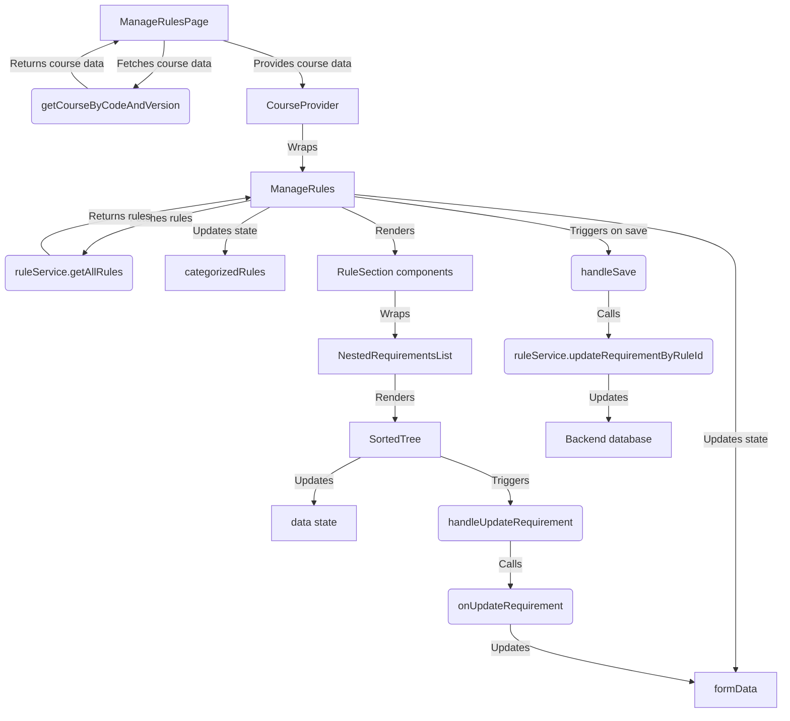

```mermaid
graph TD
    A[ManageRulesPage] -->|Fetches course data| B(getCourseByCodeAndVersion)
    B -->|Returns course data| A
    A -->|Provides course data| C[CourseProvider]
    C -->|Wraps| D[ManageRules]
    D -->|Fetches rules| E(ruleService.getAllRules)
    E -->|Returns rules| D
    D -->|Updates state| F[categorizedRules]
    D -->|Updates state| G[formData]
    D -->|Renders| H[RuleSection components]
    H -->|Wraps| I[NestedRequirementsList]
    I -->|Renders| J[SortedTree]
    J -->|Updates| K[data state]
    J -->|Triggers| L(handleUpdateRequirement)
    L -->|Calls| M(onUpdateRequirement)
    M -->|Updates| G
    D -->|Triggers on save| N(handleSave)
    N -->|Calls| O(ruleService.updateRequirementByRuleId)
    O -->|Updates| P[Backend database]

```
