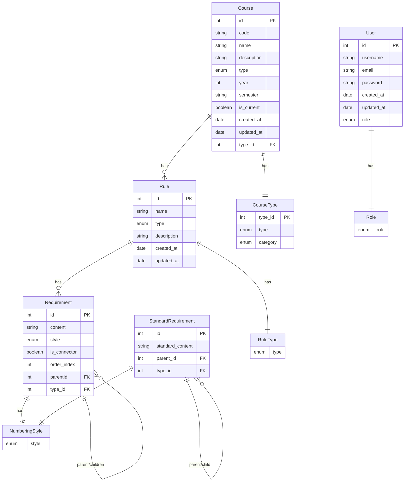

```mermaid
erDiagram
    User {
        int id PK
        string username
        string email
        string password
        date created_at
        date updated_at
        enum role
    }

    Course {
        int id PK
        string code
        string name
        string description
        enum type
        int year
        string semester
        boolean is_current
        date created_at
        date updated_at
        int type_id FK
    }

    Rule {
        int id PK
        string name
        enum type
        string description
        date created_at
        date updated_at
    }

    Requirement {
        int id PK
        string content
        enum style
        boolean is_connector
        int order_index
        int parentId FK
        int type_id FK
    }

    StandardRequirement {
        int id PK
        string standard_content
        int parent_id FK
        int type_id FK
    }

    CourseType{
        int type_id PK
        enum type
        enum category
    }

    RuleType {
        enum type
    }

    NumberingStyle {
        enum style
    }

    Role{
        enum role
    }

    Course ||--o{ Rule : has
    Rule ||--o{ Requirement : has
    Requirement ||--o{ Requirement : "parent/children"
    Course ||--|| CourseType : has
    Rule ||--|| RuleType : has
    Requirement ||--|| NumberingStyle : has
    StandardRequirement ||--o{ StandardRequirement : "parent/child"
    StandardRequirement ||--|| NumberingStyle : "has"
    User ||--|| Role : has

```
