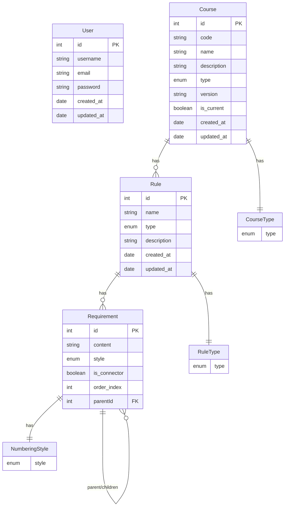

```mermaid
erDiagram
    User {
        int id PK
        string username
        string email
        string password
        date created_at
        date updated_at
    }

    Course {
        int id PK
        string code
        string name
        string description
        enum type
        string version
        boolean is_current
        date created_at
        date updated_at
    }

    Rule {
        int id PK
        string name
        enum type
        string description
        date created_at
        date updated_at
    }

    Requirement {
        int id PK
        string content
        enum style
        boolean is_connector
        int order_index
        int parentId FK
    }

    CourseType {
        enum type
    }

    RuleType {
        enum type
    }

    NumberingStyle {
        enum style
    }

    Course ||--o{ Rule : has
    Rule ||--o{ Requirement : has
    Requirement ||--o{ Requirement : "parent/children"
    Course ||--|| CourseType : has
    Rule ||--|| RuleType : has
    Requirement ||--|| NumberingStyle : has
```