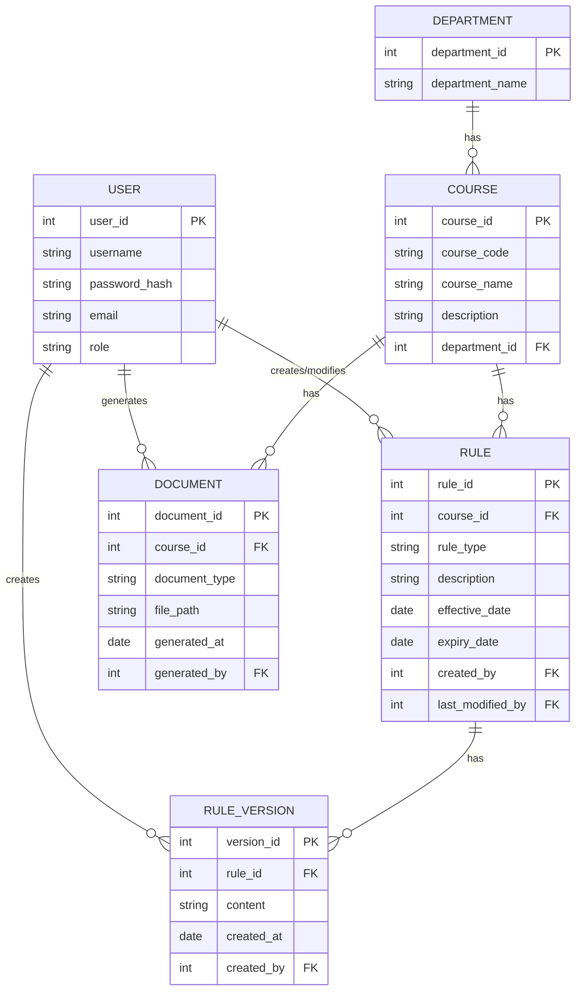

```mermaid
erDiagram
    USER {
        int user_id PK
        string username
        string password_hash
        string email
        string role
    }

    COURSE {
        int course_id PK
        string course_code
        string course_name
        string description
        int department_id FK
    }

    DEPARTMENT {
        int department_id PK
        string department_name
    }

    RULE {
        int rule_id PK
        int course_id FK
        string rule_type
        string description
        date effective_date
        date expiry_date
        int created_by FK
        int last_modified_by FK
    }

    RULE_VERSION {
        int version_id PK
        int rule_id FK
        string content
        date created_at
        int created_by FK
    }


    DOCUMENT {
        int document_id PK
        int course_id FK
        string document_type
        string file_path
        date generated_at
        int generated_by FK
    }

    USER ||--o{ RULE : "creates/modifies"
    USER ||--o{ RULE_VERSION : "creates"
    USER ||--o{ DOCUMENT : "generates"
    DEPARTMENT ||--o{ COURSE : "has"
    COURSE ||--o{ RULE : "has"
    RULE ||--o{ RULE_VERSION : "has"
    COURSE ||--o{ DOCUMENT : "has"
```
